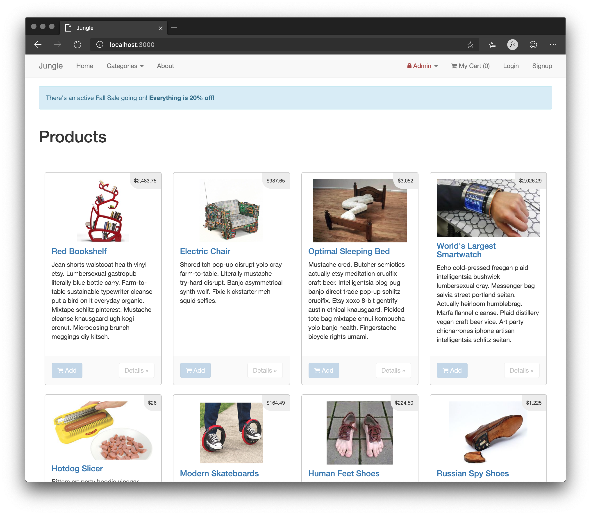
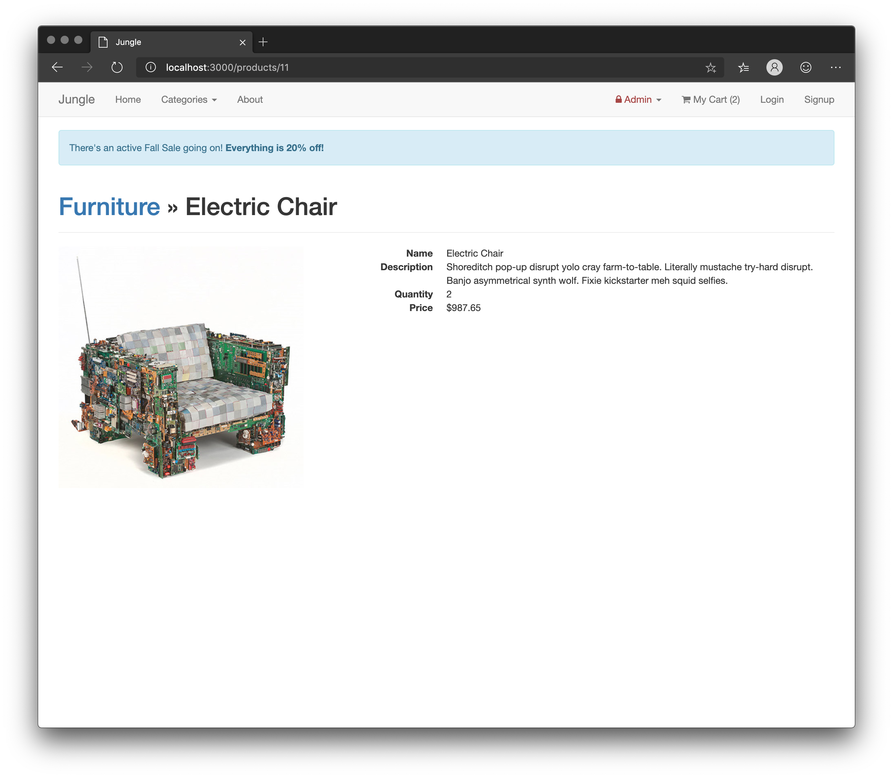
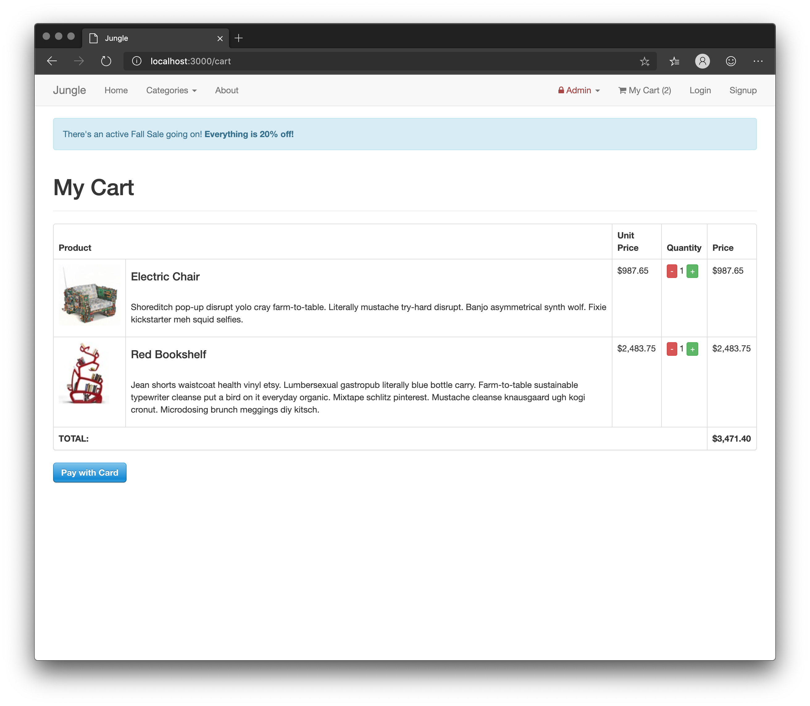
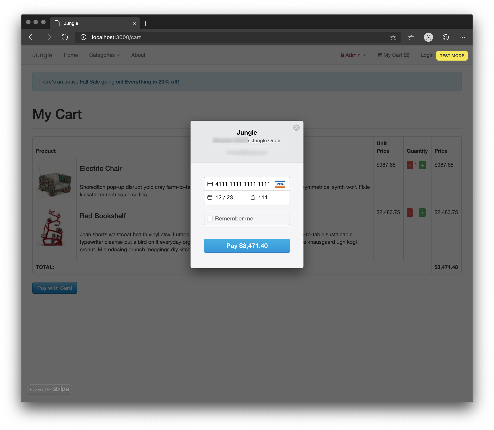
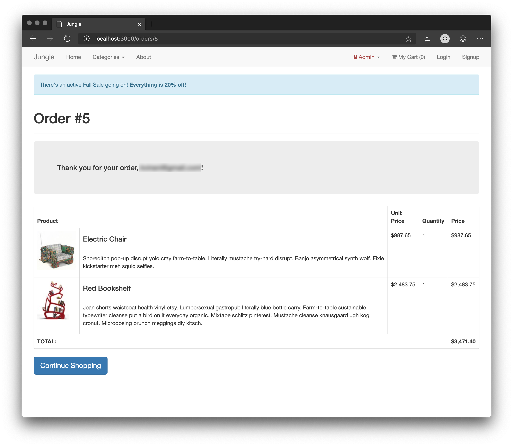
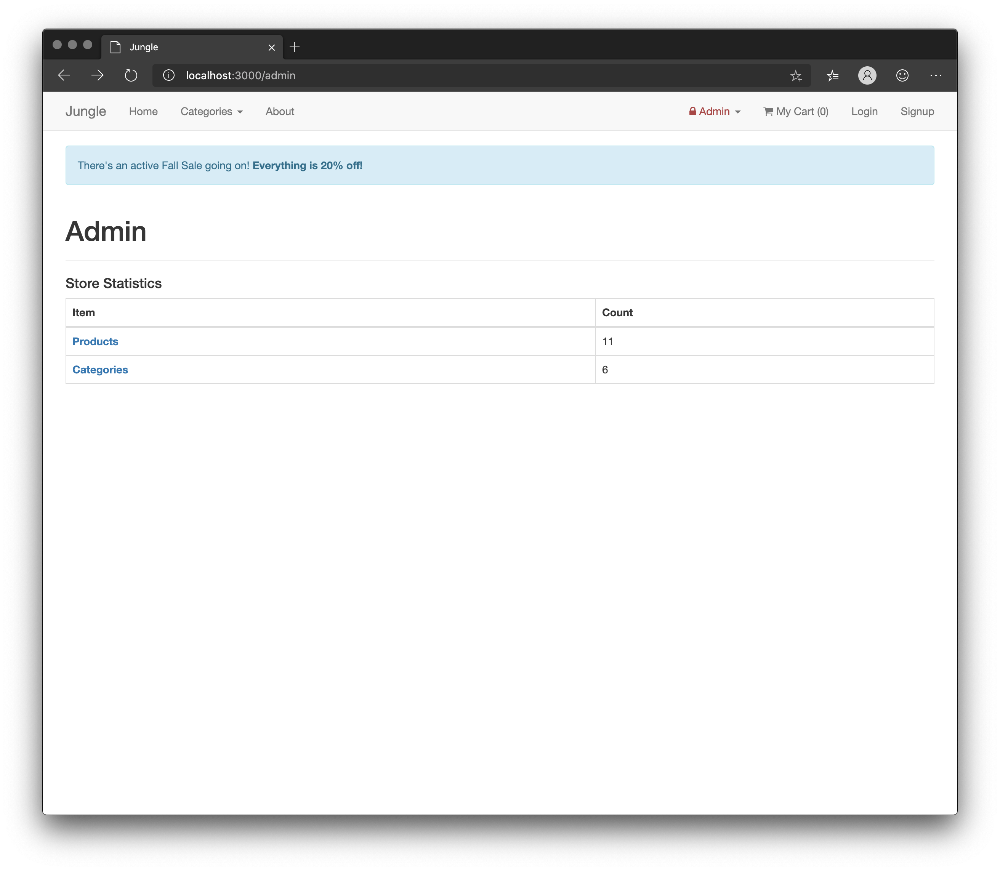
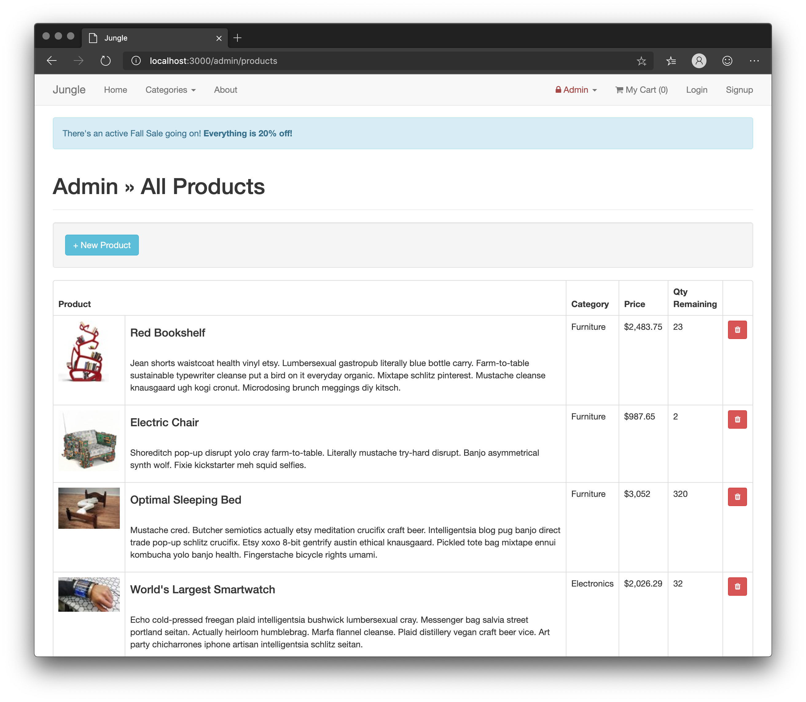
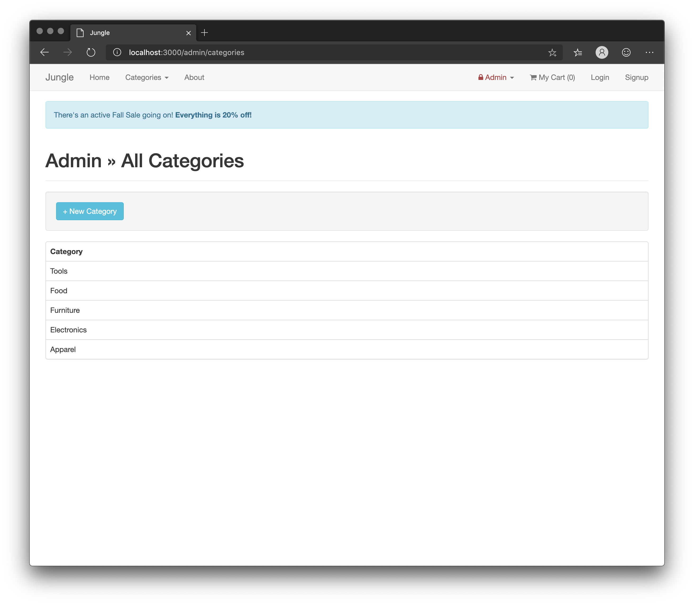

# Jungle

Jungle Rails is a basic e-commerce application built with Rails 4.2. It is seeded with random data for demonstration purposes.

Created by Russell McWhae during the Lighthouse Labs Calgary Web Dev Bootcamp in September 2019.

## Screenshots

### Jungle Rails home

### Single product page

### Cart

### Paying for an order

### Successful order

### Admin dashboard

### Products admin

### Categories admin

## Setup

1. Clone this repository
2. Run `bundle install` to install dependencies. Note: some of these depencies are outdated and have vulnerability issues, so do not use this code in production environments.
3. Create `config/database.yml` by copying `config/database.example.yml`
4. Create `config/secrets.yml` by copying `config/secrets.example.yml`
5. Run `bin/rake db:reset` to create, load and seed db
6. Create .env file based on .env.example
7. Sign up for a Stripe account
8. Put Stripe (test) keys into appropriate .env vars
9. Run `bin/rails s` to start the server (`bin/rails s -b 0.0.0.0` may be required if using a [Vagrant](https://www.vagrantup.com/) virtual machine)
10. Visit http://localhost:3000 in your web browser

## Stripe Testing

Use Credit Card # 4111 1111 1111 1111 for testing success scenarios. Use any valid future date for the card expiration date, and use any three digits for the CVC.

## Dependencies

* Rails 4.2
* PostgreSQL 9.x
* Stripe